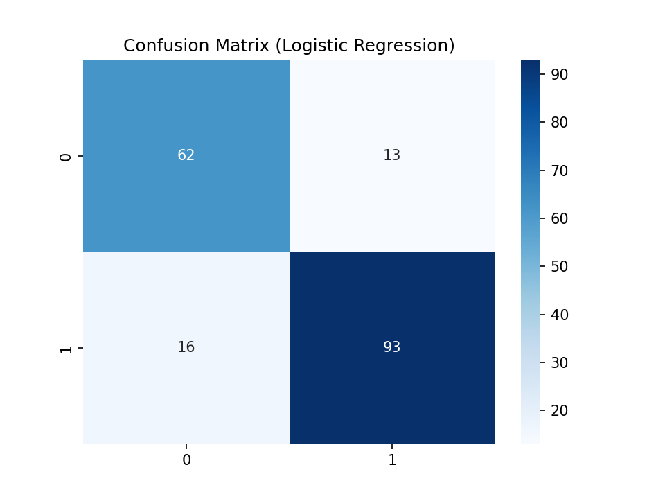
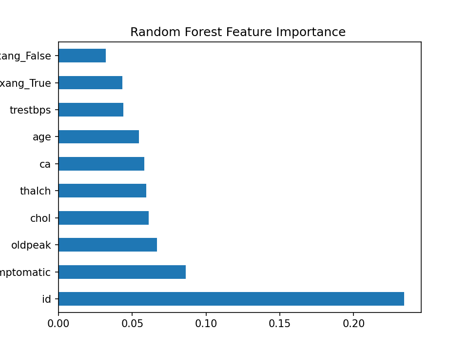

# DISEASE_PREDICTION

# 🩺 Disease Prediction  

## 📌 Overview  
The **Disease Prediction** project is a machine learning solution designed to predict diseases based on patient health records. Using classification algorithms, it analyzes medical attributes and outputs predictions that can assist in early diagnosis and decision-making in healthcare.  

---

## 🚀 Features  
- Data preprocessing: handling missing values, scaling, and encoding  
- Training multiple ML models: Logistic Regression, Decision Tree, Random Forest  
- Model evaluation using **Accuracy, Precision, Recall, F1-Score, ROC-AUC**  
- Visualizations: **Confusion Matrix** and **ROC Curve**  
- Saving the best-performing model for reuse  
- Easy-to-follow Colab notebook workflow  

---

## 🛠️ Technologies Used  
- **Python 3.x**  
- **NumPy, Pandas** → Data handling  
- **Scikit-learn** → ML models & evaluation  
- **Matplotlib, Seaborn** → Data visualization  
- **Joblib** → Model saving  

---

## 📂 Project Structure  

DISEASE_PREDICTION/
│── DISEASE_PREDICTOR.ipynb # Main Google Colab Notebook
│── README.md # Project documentation
│── requirements.txt # Dependencies
│
├── models/ # Saved trained models
│
├── reports/
│ ├── images/ # Confusion Matrix & ROC plots
│ └── slides/ # Presentation slides (if added)
│
└── data/ # Dataset (optional, if included)


---

## ⚙️ Installation  

1. Clone the repository:  
   ```bash
   git clone https://github.com/PRANAV-BORSE/DISEASE_PREDICTION.git
   cd DISEASE_PREDICTION

   ## ▶️ Usage (In Short)

1. Open `DISEASE_PREDICTOR.ipynb` in Google Colab  
2. Upload your dataset (CSV)  
3. Set dataset path and target column  
4. Run all cells to:  
   - Preprocess data  
   - Train models (Logistic Regression, Decision Tree, Random Forest)  
   - Evaluate metrics  
   - Save best model  

---

## 📊 Example Workflow  

- Load dataset  
- Preprocess data (clean, encode, scale)  
- Train models  
- Evaluate (Accuracy, Precision, Recall, F1, ROC-AUC)  
- Visualize results (Confusion Matrix & ROC Curve)  
- Save best model  

---

## Results

### Confusion Matrix (Random Forest)


### ROC Curve (Random Forest)

